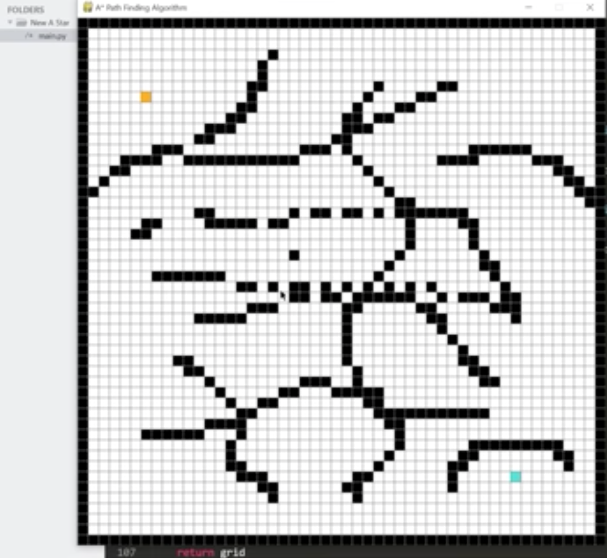

# Algorithm Visualizer
A python visualization of the A* path finding algorithm. It allows you to pick your start and end location and view the process of finding the shortest path.

# Requirements
- Python 3.x
- TKinter
- Pygame

# Schema

### User

You pick something like sorting algorithm or searching algorithm or what ever may be, then you just go ahead and visualize that

- Pick
- Visualize

### Project

- name: Algorithm Visualizer 
- description: textfield
- createdAt: timestamp
- updatedAt: timestamp

### Log
- text: textfield
- createdAt: timestamp
- updatedAt: timestamp
